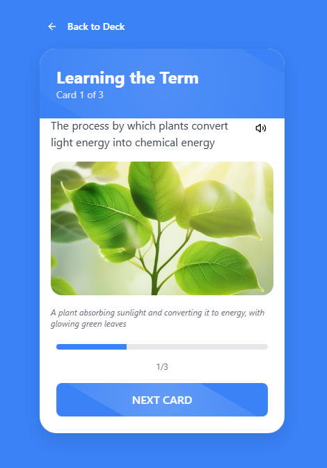

# Memory Flashcard App

A modern, AI-powered flashcard application designed to enhance memory retention through visual learning. Create custom flashcards with AI-generated images to help visualize concepts and improve recall.



## Features

### Core Functionality
- **AI-Generated Visuals**: Automatically generate relevant images for each flashcard based on the term and definition
- **Text-to-Speech**: Listen to terms and definitions with built-in audio support
- **Interactive Study Mode**: Flip cards to reveal definitions and associated images
- **Progress Tracking**: Track your progress through your flashcard deck

### Card Management
- **Create Custom Cards**: Add your own terms, definitions, and customize image prompts
- **Edit Cards**: Update existing cards with new information or regenerate images
- **Delete Cards**: Remove cards you no longer need
- **Card Organization**: View all your cards in a clean, organized list

### Customization
- **Theme Options**: Choose from 5 different color themes:
  - Purple (Default)
  - Ocean Blue
  - Forest Green
  - Sunset Orange
  - Vibrant Pink
- **Persistent Settings**: Your preferences are saved between sessions

## Getting Started

### Prerequisites
- Node.js 16.8 or later
- npm or yarn

### Installation

1. Clone the repository:
```bash
git clone https://github.com/utku-guclu/memory-flashcard-app.git
cd memory-flashcard-app
